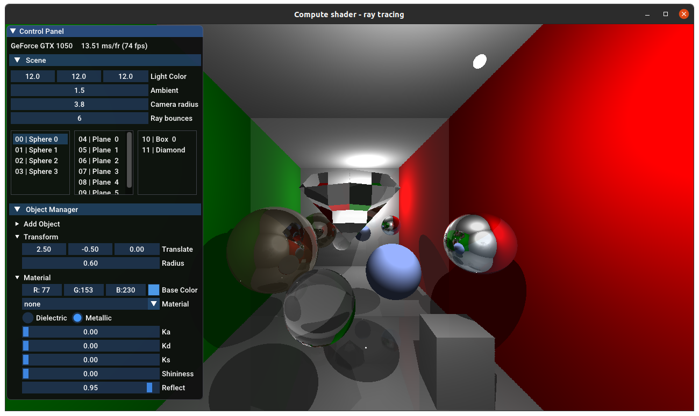
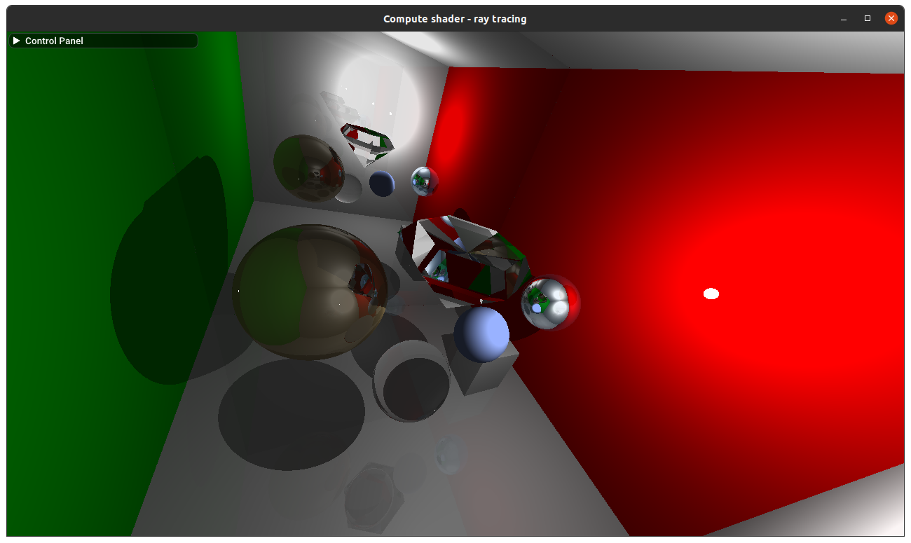
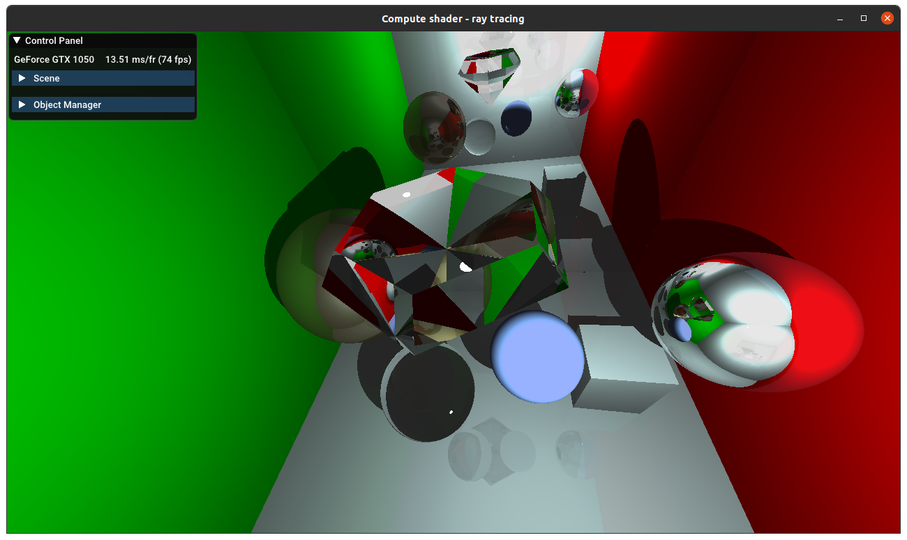
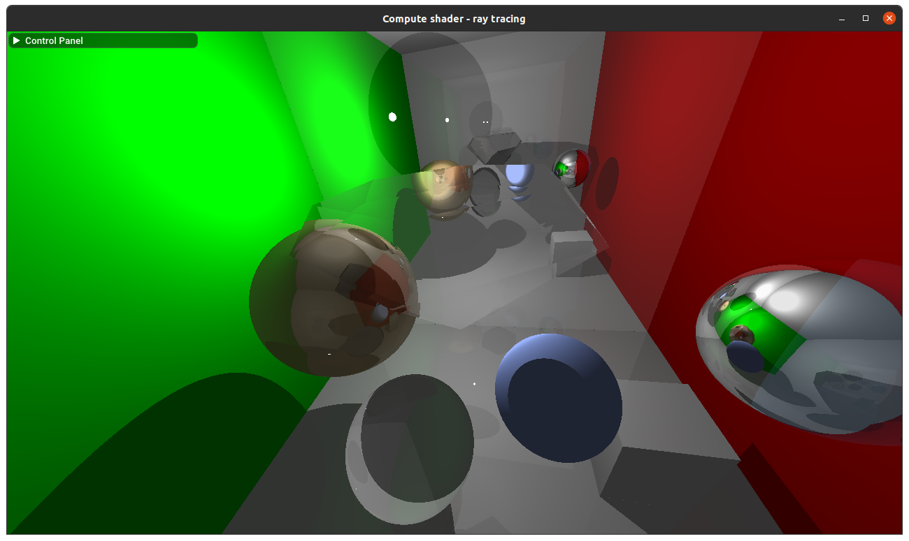
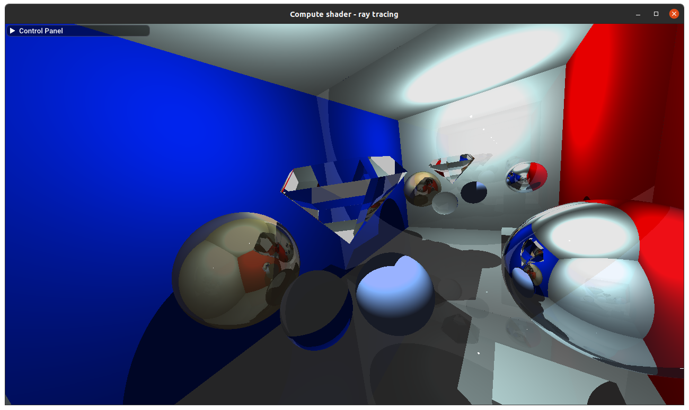
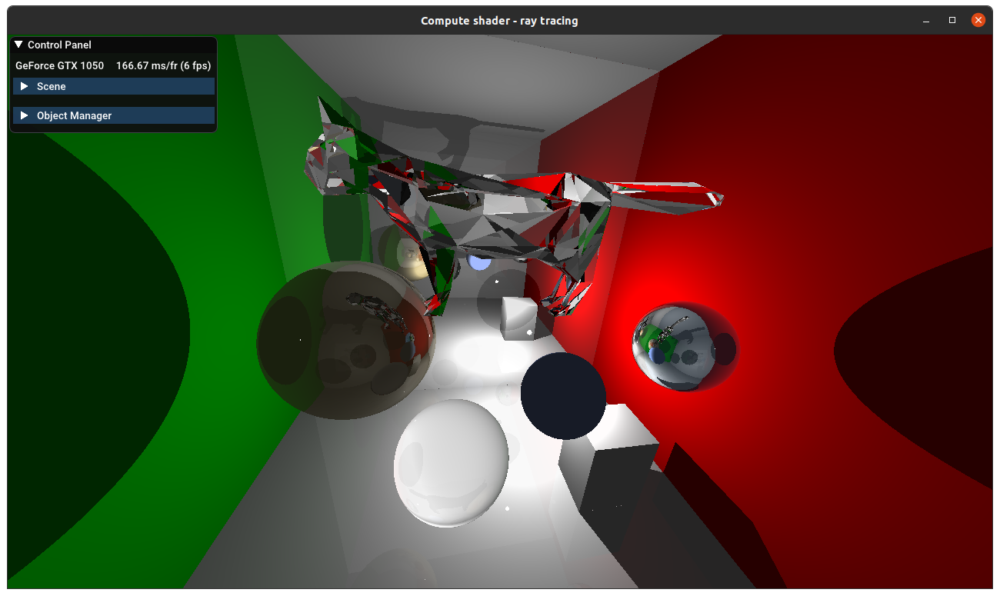
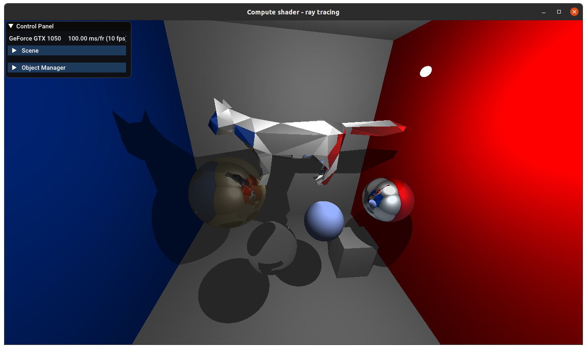

# CG-CourseProject

ComputerGraphic - Summer Practice + Course Project

## Screenshots

Программа с полным интерфейсом

Правильное рассеяние света и тени на стене

Преломление через алмаз и отражение на металлической сфере и стене

Модель алмаза практически исчезает при коэффициенте преломления 1,01

Цвет источника света и стен меняется на синий

